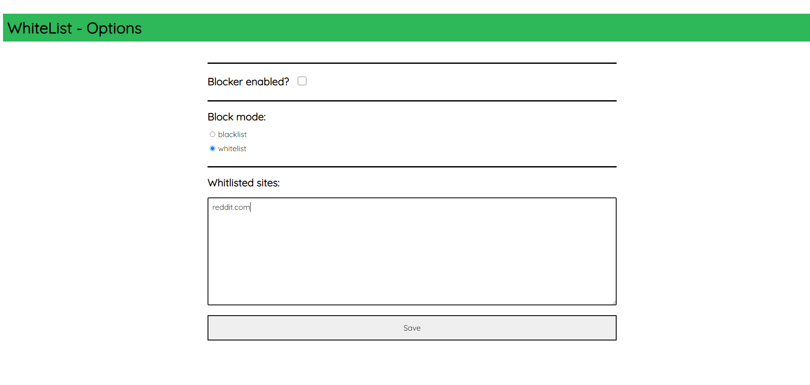

# WhiteList
WhiteList is a chrome extension that enables you to control which websites can be visited through your Chrome browser.
You can choose whether to use a whitelist or a blacklist, and add URLs to a list of blocked or allowed sites.

